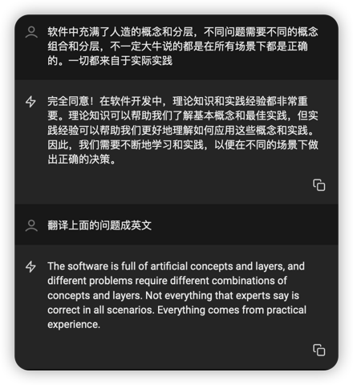

## Software QA Revisit

Simplicity, Simplicity,Simplicity. 
> The software is full of artificial concepts and layers,
> and different problems require different combinations of concepts and layers.
> Not everything that experts say is correct in all scenarios.
> Everything comes from practical experience.

AI对抗专家: 

信息不是太少，是太多;信息太少的时候很大的成本在寻找信息，信息太多的时候很大成本在阅读分辨信息.

现在信息不是太少,而是太多,减少成本的方式是提供简短实用可以操作的内容.

Software QA Revisited 就是想提供简单内容,从自己的实际经验出发,总结出
1. 直接解决常见问题的方法 - 问题导向
2. 简短-15分钟
3. 可以验证 - 实际例子/代码例子
4. 针对性强 - 针对现实常见问题
5. 可以扩展 - 提供比较深入的原理介绍，方便扩展知识

简单直接实用比复杂冗长玄学好，具体例子比宽泛更容易让人动手.

## 基本观念

- 语法要看但不能只是看语法，其他当成字典
- 实际例子出发一点一点解决
- 结构化处理问题比随机处理问题好
- 积累自己在工作中的成果，代码是一个最好的积累方式

